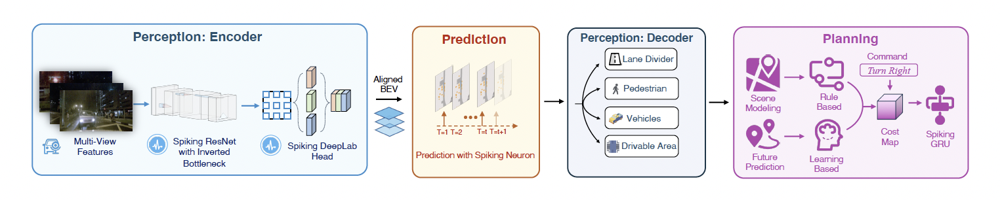

<div align=center>


</div>

<h2 align="center">Spiking Autonomous Driving (SAD): End-to-End Autonomous Driving with Spiking Neural Networks</h2>

<h5 align="center"> If you find our project useful, please give us a star ⭐ on GitHub! </h5>

## Introduction

Spiking Autonomous Driving (SAD) is the first end-to-end autonomous driving system built entirely with Spiking Neural Networks (SNNs). It integrates perception, prediction, and planning modules into a unified neuromorphic framework.

### Key Features

- End-to-end SNN architecture for autonomous driving, integrating perception, prediction, and planning
- Perception module constructs spatio-temporal Bird's Eye View (BEV) representation from multi-view cameras using SNNs
- Prediction module forecasts future states using a novel dual-pathway SNN
- Planning module generates safe trajectories considering occupancy prediction, traffic rules, and ride comfort
- Achieves performance comparable to SOTA ANN methods on nuScenes with substantially lower energy consumption

## System Overview




## Modules

### Perception

The perception module constructs a spatio-temporal BEV representation from multi-camera inputs. The encoder uses sequence repetition, while the decoder employs sequence alignment.

### Prediction

The prediction module utilizes a dual-pathway SNN, where one pathway encodes past information and the other predicts future distributions. The outputs from both pathways are fused.

### Planning

The planning module optimizes trajectories using Spiking Gated Recurrent Units (SGRUs), taking into account static occupancy, future predictions, comfort, and other factors.

## Get Started

### Setup

```
conda env create -f environment.yml
```

### Training

First, go to `/sad/configs` and modify the configs. Change the NAME in MODEL/ENCODER to the model we provided. The link is as follows: https://huggingface.co/ridger/MLP-SNN/blob/main/model.pth.tar

```
# Perception module pretraining
bash scripts/train_perceive.sh ${configs} ${dataroot}

# Prediction module pretraining 
bash scripts/train_prediction.sh ${configs} ${dataroot} ${pretrained}

# Entire model end-to-end training
bash scripts/train_plan.sh ${configs} ${dataroot} ${pretrained}
```

